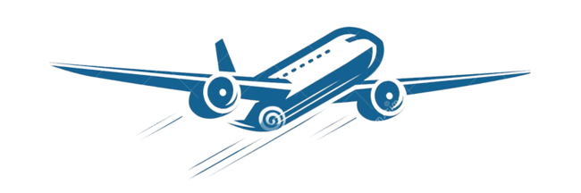

<h1 align="center">
    Projeto de Governança em TI
</h1>

    

  <a href="#informações-gerais">Informações Gerais</a>&nbsp;&nbsp;&nbsp;|&nbsp;&nbsp;&nbsp;
  <a href="#integrantes">Integrantes</a>&nbsp;&nbsp;&nbsp;|&nbsp;&nbsp;&nbsp;
  <a href="#tecnologias">Tecnologias</a>&nbsp;&nbsp;&nbsp;|&nbsp;&nbsp;&nbsp;
  <a href="#resumo-do-projeto">Resumo Projeto</a>

    Nesse semestre o novo desafio foi realizar uma Análise de Dados sobre Acidentes Aéreos Ocorridos no Brasil de 2010 a 2019 aplicando técnicas de ciência de dados       aprendidas durantes as aulas. Dados disponibilizados em: <a href="https://github.com/HigorRoc/Projeto_Gov_TI/blob/main/.Dados/ocorrencias_cenipa.csv">Ocorrências Cenipa</a>

 

<!-- INFORMAÇÕES GERAIS -->
## Informações Gerais
* Universidade Nove de Julho - UNINOVE
* Professor Edson M. Souza [(GitHub)](https://github.com/EdsonMSouza)
* Disciplina Ciência de Dados - Projeto de Gover. em TI

<!-- INTEGRANTES -->
## Integrantes
<!--|RA|Nome|Semestre|
| -------- | -------- | -------- |
|919107294|Higor Rocha Fernandes da Silva|7° Semestre|
|3019109565|Victor Nunes Pedreira|7° Semestre|
|3019203263|Guilherme Rodrigues Santos|6° semestre|
|3019201841|Matheus Meneses Messias|6° Semestre|
|3020101169|Guilherme Rocha Silva|5° Semestre|-->

<table border="1">    
  <tr>
    <th colspan="3">RA / NOME / SEMESTRE</th>
  </tr>        
  <tr>
    <td>919107294</td>
    <td>Higor Rocha Fernandes da Silva</td>
    <td>7° Semestre</td>
  </tr>
  <tr>
    <td>3019109565</td>
    <td>Victor Nunes Pedreira</td>
    <td>7° Semestre</td>
  </tr>
  <tr>
    <td>3019109565</td>
    <td>Guilherme Rodrigues Santos</td>
    <td>6° Semestre</td>
  </tr>
  <tr>
    <td>3019201841</td>
    <td>Matheus Meneses Messias</td>
    <td>6° Semestre</td>
  </tr>
  <tr>
    <td>3020101169</td>
    <td>Guilherme Rocha Silva</td>
    <td>5° Semestre</td>
  </tr>
  <tr>
    <td colspan="3"><b></b></td>
  </tr>
</table>

<!-- TECNOLOGIAS -->
## Tecnologias
Neste projeto utilizamos as seguintes ferramentas:

- &nbsp;
- 
- &nbsp; 

<!-- RESUMO DO PROJETO -->
## Resumo do Projeto

Todo levantamento estatístico foi feito diretamente da base de dados de **Ocorrências Aéreas de 2010 a 2019**, disponibilizadas pelo **CENIPA**, que é o órgão do Comando da Aeronáutica responsável pelas atividades de investigação de acidentes aeronáuticos da aviação civil e da Força Aérea Brasileira.

Buscamos demosntrar no projeto, de forma visual e gráfica, as principais informações contidas na base, essas as quais não seriam possíveis ou teriam um tempo de verificação maior se fosse via ferramenta de planilhas.

Os filtros com maior relevância nas ocorrências deste período foram:
- **Principais motivos das ocorrências:**
  - Observamos que de 2010 a 2019, a ocorrência que mais se relatou totalizando **632** casos foi **Falha no Motor em Voo**, equivalente a **12.05%** do total.

- **Horário das Ocorrências:**
  - Vemos que hoje em dia muita pessoas tem medo de voar durante a noite e ao analisar o gráfico, notamos que horário em que mais relataram ocorrências foi **00:00** com **160** casos.

- **País-Fabricante das Aeronaves:**
  - Durante a analise, fica claro que das aeronaves envolvidas em incidentes pertencem ao **Brasil** o total de **5139** casos, sendo equivalente a exatos **98%** do total de ocorrências.

- **Fase da Operação no momento da ocorrência:**
  - Conseguimos verificar que as 3 fases de operação em que mais obtiveram ocorrências envolvidas foi **Pouso (910)**, **Decolagem (852)** e **Cruzeiro (744)**, ambas equivalem a **47.8%** do total.

 

<!-- CONTRIBUIDORES  -->
## Contribuidores
[    Higor Rocha](https://github.com/HigorRoc)  Aluno/Desenvolvedor | [    Victor Nunes](https://github.com/VictorNuPe)  Aluno/Desenvolvedor | [    Matheus Meneses](https://github.com/matheus457)  Aluno/Desenvolvedor | [    Guilherme Santos](https://github.com/guilherme2601)  Aluno/Desenvolvedor | [    Guilherme Rocha](https://github.com/guilherme2601)  Aluno/Desenvolvedor | 
| :---: | :---: | :---: | :---: | :---: |

<!-- CONTATOS -->
## Contatos
&nbsp;
&nbsp;

---

Copyright ©️ 2022
