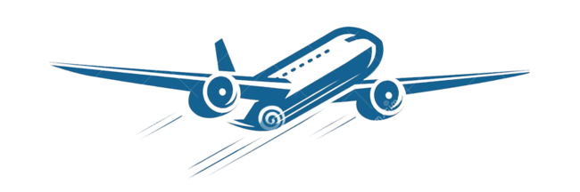
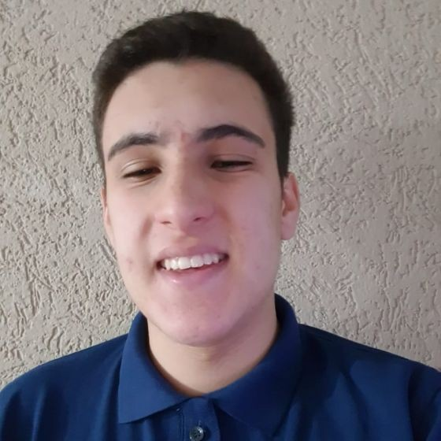

<h1 align="center">
    Projeto de Governança em TI
</h1>

    

  <a href="#informações-gerais">Informações Gerais</a>&nbsp;&nbsp;&nbsp;|&nbsp;&nbsp;&nbsp;
  <a href="#integrantes">Integrantes</a>&nbsp;&nbsp;&nbsp;|&nbsp;&nbsp;&nbsp;
  <a href="#tecnologias">Tecnologias</a>

    Nesse semestre o novo desafio foi realizar uma Análise de Dados sobre Acidentes Aéreos Ocorridos no Brasil de 2010 a 2019 aplicando técnicas de ciência de dados       aprendidas durantes as aulas.

    Os dados utilizados para analises e demonstrações gráficas deste projeto foram passados pelo professor Edson, obtido pelo Cenipa.
    Disponibilizado em: <a href="https://github.com/HigorRoc/Projeto_Gov_TI/blob/main/.Dados/ocorrencias_cenipa.csv">Ocorrências Cenipa</a>

 

<!-- INFORMAÇÕES GERAIS -->
## Informações Gerais
* Universidade Nove de Julho - UNINOVE
* Professor Edson M. Souza [(GitHub)](https://github.com/EdsonMSouza)
* Disciplina Ciência de Dados - Projeto de Gover. em TI

<!-- INTEGRANTES -->
## Integrantes
|RA|Nome|Semestre|
| -------- | -------- | -------- |
|919107294|Higor Rocha Fernandes da Silva|7° Semestre|
|3019109565|Victor Nunes Pedreira|7° Semestre|
|3019203263|Guilherme Rodrigues Santos|6° semestre|
|3019201841|Matheus Meneses Messias|6° Semestre|
|3020101169|Guilherme Rocha Silva|5° Semestre|

<table border="1">    
  <tr>
    <th colspan="2">Cabeçalho da Tabela</th>
  </tr>        
  <tr>
    <td>Linha 1 - Coluna 1</td>
    <td>Linha 1 - Ccoluna 2</td>
  </tr>
  <tr>
    <td>Linha 2 - Coluna 1</td>
    <td>Linha 2 - Coluna 2</td>
  </tr>
  <tr>
    <td colspan="2"><b>Rodapé da tabela</b></td>
  </tr>
</table>

<!-- LINGUAGENS -->
## Tecnologias
Neste projeto utilizamos as seguintes ferramentas:

- &nbsp;
- 
- &nbsp; 

<!-- CONTRIBUIDORES  -->
## Contribuidores
[    Higor Rocha](https://github.com/HigorRoc)  Aluno/Desenvolvedor | [    Victor Nunes](https://github.com/VictorNuPe)  Aluno/Desenvolvedor | [    Matheus Meneses](https://github.com/matheus457)  Aluno/Desenvolvedor | [    Guilherme Santos](https://github.com/guilherme2601)  Aluno/Desenvolvedor | [    Guilherme Rocha](https://github.com/guilherme2601)  Aluno/Desenvolvedor | 
| :---: | :---: | :---: | :---: | :---: |

<!-- CONTATOS -->
## Contatos
&nbsp;
&nbsp;

---

Copyright ©️ 2022
